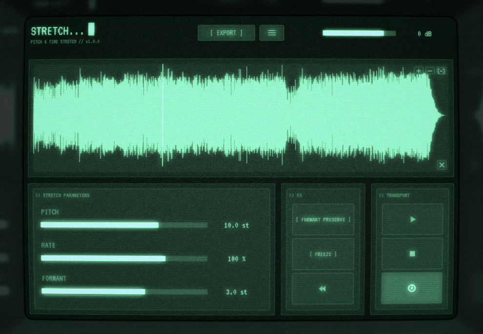

# Stretch — Pitch & Time Stretch Plugin

A VST3 / Standalone pitch-shifting and time-stretching plugin by **BalamDSP**.
Built on the [Signalsmith Stretch](https://signalsmith-audio.co.uk/code/stretch/) engine
behind a CRT terminal interface.

Formats: **VST3**, **AU** (macOS), **CLAP** + **Standalone** (JUCE 9, CMake).

<p align="center">
  
</p>

## Features

### Source & transport
- Load audio by **drag & drop** or from the **recent files** menu
  (WAV / AIFF / MP3 / FLAC / OGG). Decoding runs off the message thread.
- Transport with play/pause, stop and loop; click or drag the waveform to scrub.
- **Loop region**: SHIFT+drag on the waveform selects the section the
  transport wraps; ALT+click clears it.

### Engine
- **RATE −400 % … +400 %** with mirrored skew (0 % dead-centre, ±100 % at
  the quarter points).
- **REWIND**: latching reverse playback — flips the RATE sign at full rate.
- **FREEZE**: true rate-0 stillness; the stretcher holds its grains and the
  playhead parks. Engages from a stopped transport.
- **Pitch** ±24 semitones, **formant preserve** and formant shift ±12
  semitones.

### Export
- **Drag the EXPORT button** into your DAW / file manager, or click it for
  the saved-path card.
- Options: **WAV / AIFF / FLAC**, **16 / 24 / 32-bit float**,
  source / 44.1 / 48 / 96 kHz sample rate.
- Safety rails: >100 MB warning card, 2-minute cap on freeze / near-zero-rate
  renders.

### Interface
- Terminal panel with a toggleable **CRT overlay** based on cool-retro-term.
- Waveform view with **zoom & scroll**: mouse wheel zooms at the cursor,
  horizontal wheel / scrollbar pans, `+` / `−` / fit buttons.
- **Keyboard shortcuts** (guaranteed in Standalone, best-effort in hosts):

  | Key | Action |
  |---|---|
  | `SPACE` | play / pause |
  | `L` | loop on/off |
  | `F` | freeze on/off |
  | `R` | reverse on/off |

## Building

Requirements: CMake ≥ 3.22 and a C++17 compiler. JUCE 9.0.1 is fetched
automatically via CMake's FetchContent, and the CLAP wrapper
(`clap-juce-extensions`) is included as a git submodule.

1. Check out the repository with submodules:

   ```sh
   git clone --recurse-submodules <url>
   # or, if already cloned:
   git submodule update --init --recursive
   ```

2. Configure and build:

   ```sh
   cmake -B build
   cmake --build build --config Release
   ```

3. Artifacts land in `build/StretchPlugin_artefacts/Release/`:
   - `VST3/Stretch.vst3`
   - `Standalone/Stretch.exe`

   When `STRETCH_COPY_AFTER_BUILD` is ON (the default) plugins are also
   copied into the platform's default system plugin folders.

## Third-party

| Component | Author | License |
|---|---|---|
| JUCE framework | JUCE Ltd | AGPLv3 |
| clap-juce-extensions (CLAP wrapper) | [free-audio](https://github.com/free-audio/clap-juce-extensions) | MIT |
| Signalsmith Stretch | [Signalsmith Audio](https://signalsmith-audio.co.uk/code/stretch/) | MIT |
| cool-retro-term (CRT effect) | Filippo Scognamiglio (Swordfish90) | GPL |
| VT323 typeface | Peter Hull | OFL |

## License

Stretch — Copyright (C) 2026 BalamDSP

This program is free software: you can redistribute it and/or modify it under
the terms of the GNU Affero General Public License as published by the Free
Software Foundation, either version 3 of the License, or (at your option) any
later version.

This program is distributed in the hope that it will be useful, but WITHOUT
ANY WARRANTY; without even the implied warranty of MERCHANTABILITY or FITNESS
FOR A PARTICULAR PURPOSE. See the GNU Affero General Public License for more
details. The full text is in [LICENSE.txt](LICENSE.txt) and at
<https://www.gnu.org/licenses/>.

Third-party components remain under their own licenses (table above).
